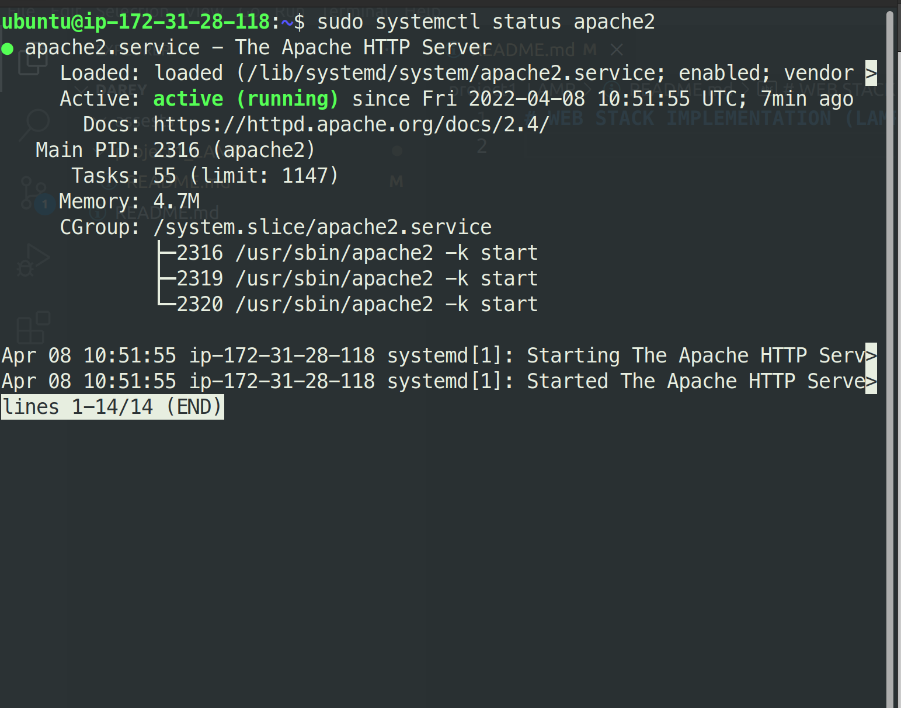
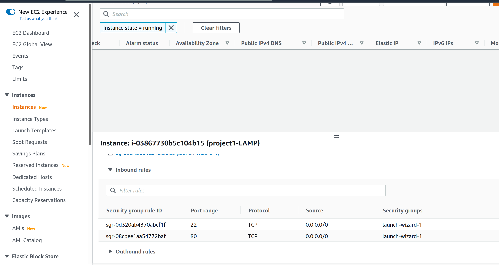
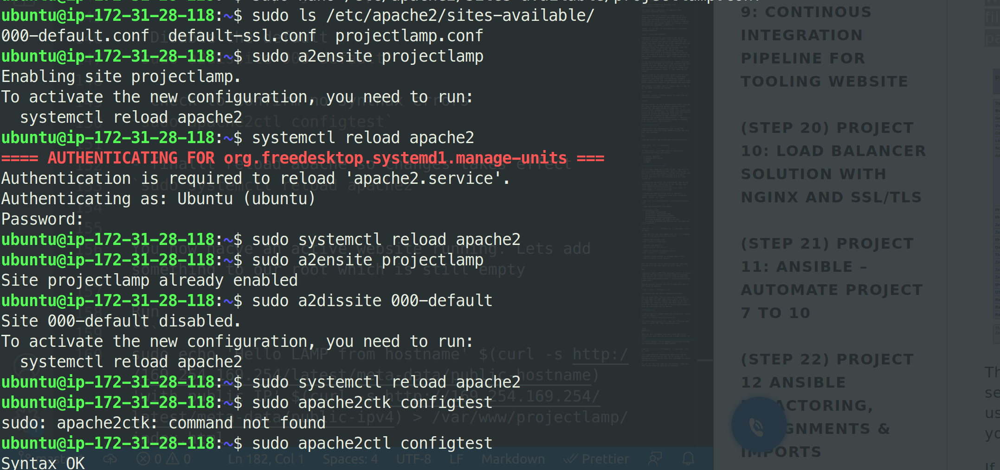

# WEB STACK IMPLEMENTATION (LAMP STACK) IN AWS

### What is a technology stack
A tech stack are basically set of frameworks or tools used to develop a software product end-to-end.

This set of frameworks and tools are very specifically chosen to work together in creating a well-functioning software.

### Types of popular tech stacks
- LAMP (Linux, Apache, MySQL, PHP or Python, or Perl)
- LEMP (Linux, Nginx, MySQL, PHP or Python, or Perl)
- MERN (MongoDB, ExpressJS, ReactJS, NodeJS)
- MEAN (MongoDB, ExpressJS, AngularJS, NodeJS

To follow through the project, you need to set up a virtual machine with Ubuntu Server OS on the cloud (AWS Prefferred) or use it locally. I will be using AWS EC2 instance (Virtual machine owned by AWS).

Virtual machines emulates same features as your personal computers with storage and network adapters etc. You can connect to this virtual machine through it's public IP. You can also connect to services running on the VM. But for these to be possible, you need to expose it to be publicly accessible through a port.

### Connecting to EC2 terminal
- Save your private key `.pem` while creating your **ec2 instance**
- Change premissions for the private key file (.pem) otherwise you can get an error "Bad permissions"
`sudo chmod 0400 <private-key-name>.pem`
- connect to the instance 
```
ssh -i <private-key-name>.pem ubuntu@<Public-IP-address>
```

### Install Apache web server
Apache web server is the server that serves you website files to the browser
```
#update a list of packages in package manager
sudo apt update

#run apache2 package installation
sudo apt install apache2
```
To verify if apache is running, run
` sudo systemctl status apache`
green and running means that you are good to go


Next go to AWs and edit the security group of your running instance.

Add an inbound rule to allow web broswers anywhere access your web server with your instance IP and Port. By default, web browers use 80 as default port.



Lets verify locally with these commands. you should see some `html` text if you did things right.
```
 curl http://localhost:80
or
 curl http://127.0.0.1:80
 ```
The above command is the same. The first uses the DNS name while the second uses IP address. Fundamentally, you should understand that your DNS name is changes to IP address under the hood whenever you visit a web address. This IP is owned by the server hosting your web address.
*in this case IP address 127.0.0.1 corresponds to DNS name ‘localhost’ and the process of converting a DNS name to IP address is called "resolution*

To verify that browsers anywhere can access our web server, run
`http://<Public-AWS-EC2-IP-Address>:80`

The page below shows everything works as it should


### Install MYSQL

MySQL is a popular relational database management system used within PHP environments, so we will use it in our project.

Run `sudo apt install mysql-server`  and comfirm installation when the prompt appear by typing `Y` and hit `Enter`

Secure your Database by running `sudo mysql_secure_installation`

This will ask if you want to configure the 
`VALIDATE PASSWORD PLUGIN.`

Note: Enabling this feature is something of a judgment call. If enabled, passwords which don’t match the specified criteria will be rejected by MySQL with an error. It is safe to leave validation disabled, but you should always use strong, unique passwords for database credentials.

Answer `Y` for yes, or anything else to continue without enabling.

I will leave mine disabled.

Regardless of whether you chose to set up the `VALIDATE PASSWORD PLUGIN`, your server will next ask you to select and confirm a password for the MySQL root user. This is not to be confused with the system root. The database root user is an administrative user with full privileges over the database system. Even though the default authentication method for the MySQL root user dispenses the use of a password, even when one is set, you should define a strong password here as an additional safety measure. We’ll talk about this in a moment.

If you enabled password validation, you’ll be shown the password strength for the root password you just entered and your server will ask if you want to continue with that password. If you are happy with your current password, enter `Y` for “yes” at the prompt:

For the rest of the questions, press Y and hit the ENTER key at each prompt. This will remove some anonymous users and the test database, disable remote root logins, and load these new rules so that MySQL immediately respects the changes you have made.

When you’re finished, test if you’re able to log in to the MySQL console by typing:

`sudo mysql`

this will connect to MuSQL server as root (has all adminstrative rights)

`mysql> `

If you observe, we set a password but didn't provide it. that is because the default authentication method for the administrative MySQL user is `unix_socket` instead of `password`. This means that since you are a root user, it shows your have secure access to access the database. providing the password is to safeguard your database from unauthorized access from applications or remotely in case the default authentication method is changed from `unix_socket` to `password`.

### Installing PHP

Lets install the dependencies that allows PHP communicates with the MySQL database first and also the `php` package.

Run:
```
sudo apt install php libapache2-mod-php php-mysql
```

Check that `php` is installed
`php -v`

At this point, your LAMP stack is completely installed and fully operational.

> [x]Linux (Ubuntu)
  [x]Apache HTTP Server
  [x]MySQL
  [x]PHP

### Configure virtual host

To test your setup with a PHP script, it’s best to set up a proper Apache Virtual Host to hold your website’s files and folders. Virtual host allows you to have multiple websites located on a single machine and users of the websites will not even notice it.

- Create the directory for projectlamp  and assign ownership of the   directory to the current user using ‘mkdir’ command as follows:
`sudo mkdir /var/www/projectlamp; sudo chown -R $USER:$USER /var/www/projectlamp`

- Create and open a config file in Apache's `sites-available` directory using your preferred editor. I will use `nano`

`sudo nano /etc/apache2/sites-available/projectlamp.conf`

- copy and pasted the file below
```
<VirtualHost *:80>
    ServerName projectlamp
    ServerAlias www.projectlamp 
    ServerAdmin webmaster@localhost
    DocumentRoot /var/www/projectlamp
    ErrorLog ${APACHE_LOG_DIR}/error.log
    CustomLog ${APACHE_LOG_DIR}/access.log combined
</VirtualHost>
```

Then hit `Ctrl + x` followed by `y` and then `Enter` to save

- see the file you just added with the `ls` command
`sudo ls /etc/apache2/sites-available`

- enable the virtual host
`sudo a2ensite projectlamp`

- Disable the default
`sudo a2dissite 000-default`

- Check to confirm no synthax errors
`sudo apache2ctl configtest`

- finallt reload aoache so changes takes effect
`sudo systemctl reload apache2`


You now hacve an active website running. Lets add something to our root which is still empty

Run
```
sudo echo 'Hello LAMP from hostname' $(curl -s http://169.254.169.254/latest/meta-data/public-hostname) 'with public IP' $(curl -s http://169.254.169.254/latest/meta-data/public-ipv4) > /var/www/projectlamp/index.html
```
Now go to your browser and try to open your website URL using IP address:

`http://<Public-IP-Address>:80`

You should see the *echo* command you wrote.

You can leave this file in place as a temporary landing page for your application until you set up an index.php file to replace it. Once you do that, remember to remove or rename the index.html file from your document root, as it would take precedence over an index.php file by default

### Enable PHP

Create a new file named index.php inside your custom web root folder:
`nano /var/www/projectlamp/index.php`

This will open a blank file. Add the following text, which is valid PHP code, inside the file:

```
<?php
phpinfo();
```
When you are finished, save and close the file, refresh the page and you will see a page similar to this:


Then hit `Ctrl + x` followed by `y` and then `Enter` to save.

This page provides information about your server from the perspective of PHP. It is useful for debugging and to ensure that your settings are being applied correctly.

If you can see this page in your browser, then your PHP installation is working as expected.
