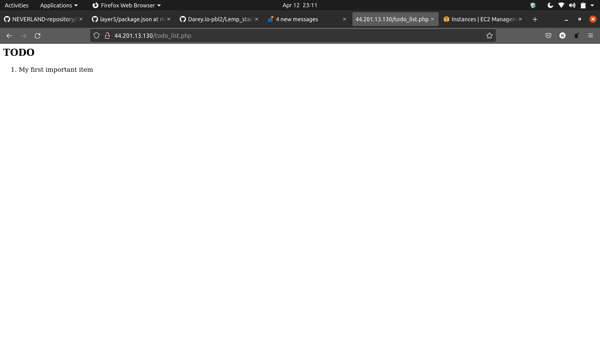

# WEB STACK IMPLEMENTATION (LEMP STACK)

### What is a technology stack
A tech stack are basically set of frameworks or tools used to develop a software product end-to-end.

This set of frameworks and tools are very specifically chosen to work together in creating a well-functioning software.

### Types of popular tech stacks
- LAMP (Linux, Apache, MySQL, PHP or Python, or Perl)
- LEMP (Linux, Nginx, MySQL, PHP or Python, or Perl)
- MERN (MongoDB, ExpressJS, ReactJS, NodeJS)
- MEAN (MongoDB, ExpressJS, AngularJS, NodeJS

To follow through the project, you need to set up a virtual machine with Ubuntu Server OS on the cloud (AWS Prefferred) or use it locally. I will be using AWS EC2 instance (Virtual machine owned by AWS).

Virtual machines emulates same features as your personal computers with storage and network adapters etc. You can connect to this virtual machine through it's public IP. You can also connect to services running on the VM. But for these to be possible, you need to expose it to be publicly accessible through a port.

### Connecting to EC2 terminal
- Save your private key `.pem` while creating your **ec2 instance**
- Change premissions for the private key file (.pem) otherwise you can get an error "Bad permissions"
`sudo chmod 0400 <private-key-name>.pem`
- connect to the instance 
```
ssh -i <private-key-name>.pem ubuntu@<Public-IP-address>
```

## Step 1 – Installing the Nginx Web Server

### Step 1 – Installing the Nginx Web Server

```
sudo apt update
sudo apt install nginx
```
### Verify that `NGINX` is installed
```
sudo systemctl status nginx
```
Open inbound rule at `port 80` by adding new security group rule to your running `EC2` instance.


Our server is running and we can access it locally and from the Internet (Source 0.0.0.0/0 means ‘from any IP address’).

First, let us try to check how we can access it locally in our Ubuntu shell, run:
```
curl http://localhost:80
or
curl http://127.0.0.1:80
```

If the out is some strangely formatted `html` text, then youa are good to go.

Hit the `nginx` server from your browser
```
http://<Public-IP_Address>:80
```


### Install MYSQL

MySQL is a popular relational database management system used within PHP environments, so we will use it in our project.

Run `sudo apt install mysql-server`  and comfirm installation when the prompt appear by typing `Y` and hit `Enter`

Secure your Database by running `sudo mysql_secure_installation`

This will ask if you want to configure the 
`VALIDATE PASSWORD PLUGIN.`

Note: Enabling this feature is something of a judgment call. If enabled, passwords which don’t match the specified criteria will be rejected by MySQL with an error. It is safe to leave validation disabled, but you should always use strong, unique passwords for database credentials.

Answer `Y` for yes, or anything else to continue without enabling.

I will leave mine disabled.

Regardless of whether you chose to set up the `VALIDATE PASSWORD PLUGIN`, your server will next ask you to select and confirm a password for the MySQL root user. This is not to be confused with the system root. The database root user is an administrative user with full privileges over the database system. Even though the default authentication method for the MySQL root user dispenses the use of a password, even when one is set, you should define a strong password here as an additional safety measure. We’ll talk about this in a moment.

If you enabled password validation, you’ll be shown the password strength for the root password you just entered and your server will ask if you want to continue with that password. If you are happy with your current password, enter `Y` for “yes” at the prompt:

For the rest of the questions, press Y and hit the ENTER key at each prompt. This will remove some anonymous users and the test database, disable remote root logins, and load these new rules so that MySQL immediately respects the changes you have made.

When you’re finished, test if you’re able to log in to the MySQL console by typing:

`sudo mysql`

this will connect to MuSQL server as root (has all adminstrative rights)

`mysql> `

If you observe, we set a password but didn't provide it. that is because the default authentication method for the administrative MySQL user is `unix_socket` instead of `password`. This means that since you are a root user, it shows your have secure access to access the database. providing the password is to safeguard your database from unauthorized access from applications or remotely in case the default authentication method is changed from `unix_socket` to `password`.

## Installing PHP

Lets install the dependencies that allows PHP communicates with the MySQL database first and also the `php` package.

Run:
```
sudo apt install php-fpm php-mysql
```

Check that `php` is installed
`php -v`

At this point, your LAMP stack is completely installed and fully operational.

> [x]Linux (Ubuntu)
  [x]NGINX HTTP Server
  [x]MySQL
  [x]PHP

### Configuring Nginx to Use PHP Processor
### Configuring Nginx to Use PHP Processor
Create the root web directory for your_domain as follows:
```
sudo mkdir /var/www/projectLEMP
```

Next, assign ownership of the directory with the $USER environment variable, which will reference your current system user:
```
sudo chown -R $USER:$USER /var/www/projectLEMP
```

Then, open a new configuration file in Nginx’s sites-available directory using your preferred command-line editor. Here, we’ll use nano:
```
sudo nano /etc/nginx/sites-available/projectLEMP
```
This will create a new blank file. Paste in the following bare-bones configuration:

```
#/etc/nginx/sites-available/projectLEMP

server {
    listen 80;
    server_name projectLEMP www.projectLEMP;
    root /var/www/projectLEMP;

    index index.html index.htm index.php;

    location / {
        try_files $uri $uri/ =404;
    }

    location ~ \.php$ {
        include snippets/fastcgi-php.conf;
        fastcgi_pass unix:/var/run/php/php7.4-fpm.sock;
     }

    location ~ /\.ht {
        deny all;
    }

}
```


Here’s what each of these directives and location blocks do:

`listen` — Defines what port Nginx will listen on. In this case, it will listen on port 80, the default port for HTTP.
`root` — Defines the document root where the files served by this website are stored.
`index` — Defines in which order Nginx will prioritize index files for this website. It is a common practice to list index.html files with a higher precedence than index.php files to allow for quickly setting up a maintenance landing page in PHP applications. You can adjust these settings to better suit your application needs.
`server_name` — Defines which domain names and/or IP addresses this server block should respond for. **Point this directive to your server’s domain name or public IP address.**
`location /` — The first location block includes a try_files directive, which checks for the existence of files or directories matching a URI request. If Nginx cannot find the appropriate resource, it will return a 404 error.
`location ~ \.php$` — This location block handles the actual PHP processing by pointing Nginx to the fastcgi-php.conf configuration file and the php7.4-fpm.sock file, which declares what socket is associated with php-fpm.
`location ~ /\.ht` — The last location block deals with .htaccess files, which Nginx does not process. By adding the deny all directive, if any .htaccess files happen to find their way into the document root ,they will not be served to visitors.

When you’re done editing, save and close the file. If you’re using nano, you can do so by typing CTRL+X and then y and ENTER to confirm.

Activate your configuration by linking to the config file from Nginx’s sites-enabled directory:

```
sudo ln -s /etc/nginx/sites-available/projectLEMP /etc/nginx/sites-enabled/
```

This will tell Nginx to use the configuration next time it is reloaded. You can test your configuration for syntax errors by typing:
```
sudo nginx -t
```

We also need to disable default Nginx host that is currently configured to listen on port 80, for this run:
```
sudo unlink /etc/nginx/sites-enabled/default
```
When you are ready, reload Nginx to apply the changes:
```
sudo systemctl reload nginx
```
Your new website is now active, but the web root /var/www/projectLEMP is still empty. Create an index.html file in that location so that we can test that your new server block works as expected:
```
sudo echo 'Hello LEMP from hostname' $(curl -s http://169.254.169.254/latest/meta-data/public-hostname) 'with public IP' $(curl -s http://169.254.169.254/latest/meta-data/public-ipv4) > /var/www/projectLEMP/index.html
```
Now go to your browser and try to open your website URL using IP address:
```
http://<Public-IP-Address>:80
```

You should get a page like this
```
Hello LEMP from hostname ec2-44-201-13-130.compute-1.amazonaws.com with public IP 44.201.13.130 
```
Your LEMP stack is now fully configured. In the next step, we’ll create a PHP script to test that Nginx is in fact able to handle .php files within your newly configured website.

## Testing PHP with Nginx
Test to validate that Nginx can correctly hand .php files off to your PHP processor.

Create a test PHP file in your document root. Open a new file called `info.php` within your document root in your text editor:
```
sudo nano /var/www/projectLEMP/info.php
```

Type or paste the following lines into the new file. This is valid PHP code that will return information about your server:
```
<?php
phpinfo();
```

You can now access this page in your web browser by visiting the domain name or public IP address you’ve set up in your Nginx configuration file, followed by /info.php:
```
http://`server_domain_or_IP`/info.php
````

You will see a web page containing detailed information about your server:

## Retrieving data from MySQL database with PHP (continued)

We will create a database named example_database and a user named example_user, but you can replace these names with different values.

First, connect to the MySQL console using the root account:
```
sudo mysql
```
To create a new database, run the following command from your MySQL console:
```
mysql> CREATE DATABASE `example_database`;
```
Now you can create a new user and grant him full privileges on the database you have just created.
```
CREATE TABLE test_database.todo_list (
mysql>     item_id INT AUTO_INCREMENT,
mysql>     content VARCHAR(255),
mysql>     PRIMARY KEY(item_id)
mysql> );
```
Insert a few rows of content in the test table. You might want to repeat the next command a few times, using different VALUES:
```
mysql> INSERT INTO example_database.todo_list (content) VALUES ("My first important item");
```
To confirm that the data was successfully saved to your table, run:
```
mysql>  SELECT * FROM example_database.todo_list;
```
After confirming that you have valid data in your test table, you can exit the MySQL console:
```
mysql> exit
```
Now you can create a PHP script that will connect to MySQL and query for your content. Create a new PHP file in your custom web root directory using your preferred editor. We’ll use vi for that:
```
nano /var/www/projectLEMP/todo_list.php
```
The following PHP script connects to the MySQL database and queries for the content of the todo_list table, displays the results in a list. If there is a problem with the database connection, it will throw an exception.

Copy this content into your todo_list.php script:
```
<?php
$user = "example_user";
$password = "password";
$database = "example_database";
$table = "todo_list";

try {
  $db = new PDO("mysql:host=localhost;dbname=$database", $user, $password);
  echo "<h2>TODO</h2><ol>";
  foreach($db->query("SELECT content FROM $table") as $row) {
    echo "<li>" . $row['content'] . "</li>";
  }
  echo "</ol>";
} catch (PDOException $e) {
    print "Error!: " . $e->getMessage() . "<br/>";
    die();
}
```
Save and close the file when you are done editing.

You can now access this page in your web browser by visiting the domain name or public IP address configured for your website, followed by /todo_list.php:
```
http://<Public_domain_or_IP>/todo_list.php
```
You should see a page like this, showing the content you’ve inserted in your test table:



Congratulations!