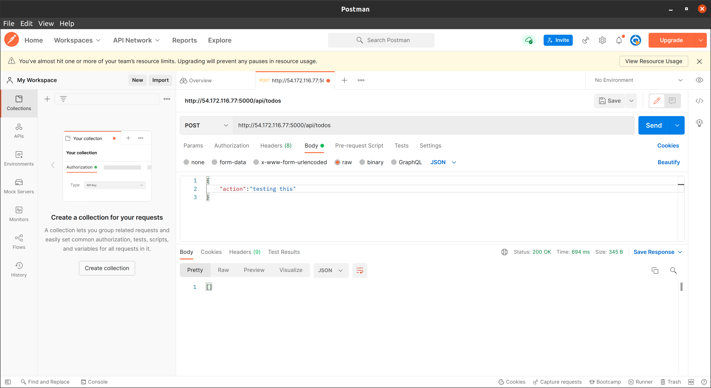
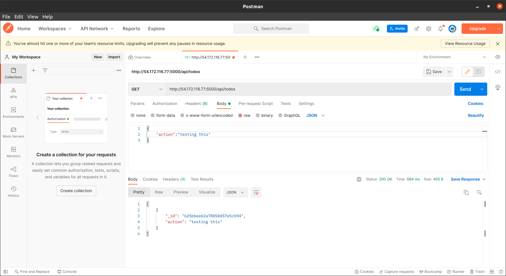
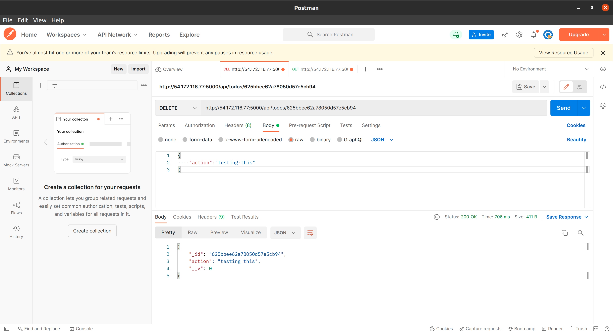
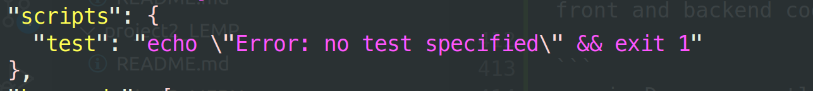
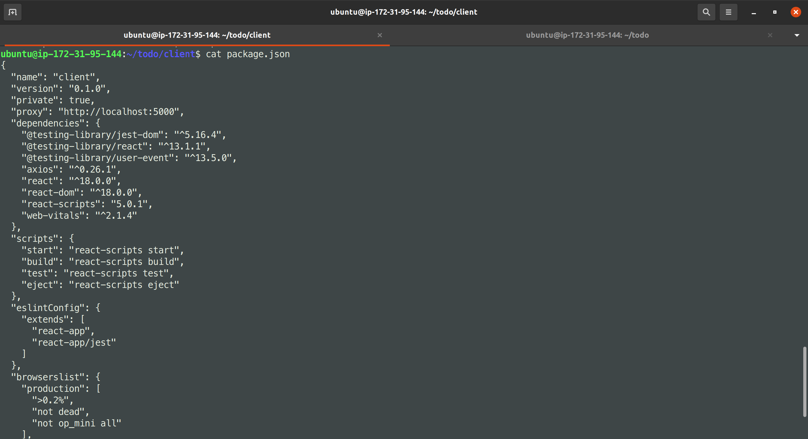
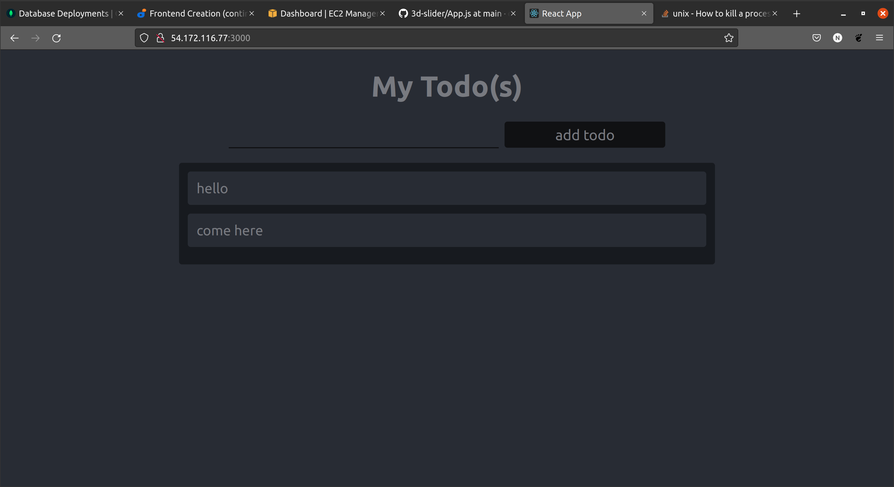

# Simple To-Do application on MERN Web Stack

### What is a technology stack
A tech stack are basically set of frameworks or tools used to develop a software product end-to-end.

This set of frameworks and tools are very specifically chosen to work together in creating a well-functioning software.

### Types of popular tech stacks
- LAMP (Linux, Apache, MySQL, PHP or Python, or Perl)
- LEMP (Linux, Nginx, MySQL, PHP or Python, or Perl)
- MERN (MongoDB, ExpressJS, ReactJS, NodeJS)
- MEAN (MongoDB, ExpressJS, AngularJS, NodeJS

To follow through the project, you need to set up a virtual machine with Ubuntu Server OS on the cloud (AWS Prefferred) or use it locally. I will be using AWS EC2 instance (Virtual machine owned by AWS).

Virtual machines emulates same features as your personal computers with storage and network adapters etc. You can connect to this virtual machine through it's public IP. You can also connect to services running on the VM. But for these to be possible, you need to expose it to be publicly accessible through a port.

### Connecting to EC2 terminal
- Save your private key `.pem` while creating your **ec2 instance**
- Change premissions for the private key file (.pem) otherwise you can get an error "Bad permissions"
`sudo chmod 0400 <private-key-name>.pem`
- connect to the instance 
```
ssh -i <private-key-name>.pem ubuntu@<Public-IP-address>
```

# Step-1 Backend configurations
Update your ubuntu
```
sudo apt update && sudo apt-get upgrade
```

Lets get the location of Node.js software from Ubuntu repositories.
```
curl -sL https://deb.nodesource.com/setup_14.x | sudo -E bash -
```

Install `NodeJs` and `NPM`
```
sudo apt-get install -y nodejs
```

check node version
```
node -v
```
check npm version
```
npm -v
```


### Application code setup
Create a new directory for your To-Do project:
```
mkdir todo
```
Run the command below to verify that the Todo directory is created with ls command
```
ls
```
Go into the todo directory
```
cd todo
```
Initialise project
```
npm init
```


### Install ExpressJS

```
npm i express
```
Now create a file index.js with the command below
```
touch index.js
```
Run ls to confirm that your index.js file is successfully created

Install the dotenv module
```
npm install dotenv
```
Open the index.js file with the command below
```
vim index.js
```

Type the code below into it and save. 
```
const express = require('express');
require('dotenv').config();

const app = express();

const port = process.env.PORT || 5000;

app.use((req, res, next) => {
res.header("Access-Control-Allow-Origin", "\*");
res.header("Access-Control-Allow-Headers", "Origin, X-Requested-With, Content-Type, Accept");
next();
});

app.use((req, res, next) => {
res.send('Welcome to Express');
});

app.listen(port, () => {
console.log(`Server running on port ${port}`)
});
```

Save the file
```
Esc key then type :wq
```
This will write and exit the editor.

Run your app
```
node index.js
```


Notice that we have specified to use port 5000 in the code. This will be required later when we go on the browser.

Set up security rules to able to view your application on this `port 5000`


Open up your browser and try to access your server’s Public IP or Public DNS name followed by port 5000:
```
http://<PublicIP-or-PublicDNS>:5000
```


Routes

There are three actions that our To-Do application needs to be able to do:

    Create a new task
    Display list of all tasks
    Delete a completed task

Each task will be associated with some particular endpoint and will use different standard HTTP request methods: POST, GET, DELETE.

For each task, we need to create routes that will define various endpoints that the To-do app will depend on. So let us create a folder routes
```
mkdir routes
```
**Tip: You can open multiple shells in Putty or Linux/Mac to connect to the same EC2**

Change directory to routes folder.
```
cd routes
```
Now, create a file api.js with the command below
```
touch api.js
```
Open the file with the command below
```
vim api.js
```
Copy below code in the file. (Do not be overwhelmed with the code)
```
const express = require ('express');
const router = express.Router();

router.get('/todos', (req, res, next) => {

});

router.post('/todos', (req, res, next) => {

});

router.delete('/todos/:id', (req, res, next) => {

})

module.exports = router;
```
Moving forward create `Models` directory.
models to define the database schema

In essence, the Schema is a blueprint of how the database will be constructed, including other data fields that may not be required to be stored in the database. These are known as `virtual properties`

We will be using mongo database therefore we need another package to create our schema easily

```
cd ..
```

```
npm install mongoose
```

create models directory
```
mkdir models
```
```
cd models
```
```
touch todo.js
```

Tip: All three commands above can be defined in one line to be executed consequently with help of && operator, like this:
```
mkdir models && cd models && touch todo.js
```
Open the file created with `vim todo.js` then paste the code below in the file:
```
const mongoose = require('mongoose');
const Schema = mongoose.Schema;

//create schema for todo
const TodoSchema = new Schema({
action: {
type: String,
required: [true, 'The todo text field is required']
}
})

//create model for todo
const Todo = mongoose.model('todo', TodoSchema);

module.exports = Todo;
```


update the routes from the file `api.js` in ‘routes’ directory to make use of the new model.

In Routes directory, open api.js with vim api.js, delete the code inside with `:%d` command and paste there code below into it then save and exit

```
const express = require ('express');
const router = express.Router();
const Todo = require('../models/todo');

router.get('/todos', (req, res, next) => {

//this will return all the data, exposing only the id and action field to the client
Todo.find({}, 'action')
.then(data => res.json(data))
.catch(next)
});

router.post('/todos', (req, res, next) => {
if(req.body.action){
Todo.create(req.body)
.then(data => res.json(data))
.catch(next)
}else {
res.json({
error: "The input field is empty"
})
}
});

router.delete('/todos/:id', (req, res, next) => {
Todo.findOneAndDelete({"_id": req.params.id})
.then(data => res.json(data))
.catch(next)
})

module.exports = router;
```


setup mongodb database


Allow access to the MongoDB database from anywhere (Not secure, but it is ideal for testing)

IMPORTANT NOTE
In the image below, make sure you change the time of deleting the entry from 6 Hours to 1 Week


Create a MongoDB database and collection inside mLab


Create `.env` file so we can save our environmental variable there.
Create it in the `/todo` root.
```
touch .env
```
```
vim .env
```

Add the connection string to access the database in it, just as below:
```
DB = 'mongodb+srv://<username>:<password>@<network-address>/<dbname>?retryWrites=true&w=majority'
```
Ensure to update `<username>`, `<password>`, `<network-address>` and `<database>`according to your setup

Here is how to get your connection string


Now we need to update the index.js to reflect the use of .env so that Node.js can connect to the database.

Simply delete existing content in the file, and update it with the entire code below.

To do that using vim, follow below steps

    Open the file with vim index.js
    Press esc
    Type :
    Type %d
    Hit ‘Enter’

The entire content will be deleted, then,

    Press i to enter the insert mode in vim
    Now, paste the entire code below in the file.

```
const express = require('express');
const bodyParser = require('body-parser');
const mongoose = require('mongoose');
const routes = require('./routes/api');
const path = require('path');
require('dotenv').config();

const app = express();

const port = process.env.PORT || 5000;

//connect to the database
mongoose.connect(process.env.DB, { useNewUrlParser: true, useUnifiedTopology: true })
.then(() => console.log(`Database connected successfully`))
.catch(err => console.log(err));

//since mongoose promise is depreciated, we overide it with node's promise
mongoose.Promise = global.Promise;

app.use((req, res, next) => {
res.header("Access-Control-Allow-Origin", "\*");
res.header("Access-Control-Allow-Headers", "Origin, X-Requested-With, Content-Type, Accept");
next();
});

app.use(bodyParser.json());

app.use('/api', routes);

app.use((err, req, res, next) => {
console.log(err);
next();
});

app.listen(port, () => {
console.log(`Server running on port ${port}`)
});
```

Start your server:
```
node index.js
```
Testing Backend Code without Frontend using RESTful API `Download Postman`

Click [Install Postman](https://www.getpostman.com/downloads/) to download and install postman on your machine.


Click [HERE](https://www.youtube.com/watch?v=FjgYtQK_zLE) to learn how perform CRUD operartions on Postman 

Now open your Postman, create a POST request to the API    `http://<PublicIP-or-PublicDNS>:5000/api/todos`. This request sends a new task to our To-Do list so the application could store it in the database.

Note: make sure your set header key Content-Type as `application/json`



Create a GET request to your API on `http://<PublicIP-or-PublicDNS>:5000/api/todos`. This request retrieves all existing records from out To-do application (backend requests these records from the database and sends it us back as a response to GET request).



Create a `DELETE` request to your API on `http://<PublicIP-or-PublicDNS>:5000/api/todos/:id`. These request will take in an `id` in our `todo` database and delete it. 




   - Display a list of tasks – HTTP GET request
   - Add a new task to the list – HTTP POST request
   - Delete an existing task from the list – HTTP DELETE request

We have successfully created our Backend, now let go create the Frontend

# Step 2 – Frontend creation

In the same root directory as your backend code, which is the Todo directory, run:
```
 npx create-react-app client
```
This will create a new folder in your `Todo` directory called `client`, where you will add all the react code.

install package to help us run our front and backend code concurrently

```
npm i -D concurrently
```

This will install concurrently as developement dependency

Install nodemon to keep our server running and also track changes made to our server
```
npm i -D nodemon
```

In the same root directory as your backend code, which is the Todo directory, run:

 npx create-react-app client

This will create a new folder in your Todo directory called client, where you will add all the react code.

```
"scripts": {
"start": "node index.js",
"start-watch": "nodemon index.js",
"dev": "concurrently \"npm run start-watch\" \"cd client && npm start\""
},
```


Configure Proxy in package.json

    Change directory to ‘client’

cd client

    Open the package.json file

vi package.json

    Add the key value pair in the package.json file "proxy": "http://localhost:5000".

The whole purpose of adding the proxy configuration in number 3 above is to make it possible to access the application directly from the browser by simply calling the server url like 
`http://localhost:5000` rather than always including the entire path like `http://localhost:5000/api/todos`

Now, ensure you are inside the Todo directory, and simply do:
```
npm run dev
```
Your app should open and start running on `localhost:3000`

**Important note:** In order to be able to access the application from the Internet you have to open TCP port 3000 on EC2 by adding a new Security Group rule. You already know how to do it.

Create  React Frontend components

 ```
 cd client
 ```
 ```
 mkdir components
 ```

 ```
 cd components
 ```
 ```
 touch Input.js ListTodo.js Todo.js
 ```
 Open `Input.js` file
```
vi Input.js
```
Copy and paste the following
```
import React, { Component } from 'react';
import axios from 'axios';

class Input extends Component {

state = {
action: ""
}

addTodo = () => {
const task = {action: this.state.action}

    if(task.action && task.action.length > 0){
      axios.post('/api/todos', task)
        .then(res => {
          if(res.data){
            this.props.getTodos();
            this.setState({action: ""})
          }
        })
        .catch(err => console.log(err))
    }else {
      console.log('input field required')
    }

}

handleChange = (e) => {
this.setState({
action: e.target.value
})
}

render() {
let { action } = this.state;
return (
<div>
<input type="text" onChange={this.handleChange} value={action} />
<button onClick={this.addTodo}>add todo</button>
</div>
)
}
}

export default Input
```

`axios` is used to make request to the `api` Since we used it and haven't installed it.

Move to client root and run
```
cd ..  && npm i axios
```



Axios is installed

Go to ‘components’ directory
```
cd src/components
```
After that open your ListTodo.js
```
vi ListTodo.js
```
in the ListTodo.js copy and paste the following code
```
import React from 'react';

const ListTodo = ({ todos, deleteTodo }) => {

return (
<ul>
{
todos &&
todos.length > 0 ?
(
todos.map(todo => {
return (
<li key={todo._id} onClick={() => deleteTodo(todo._id)}>{todo.action}</li>
)
})
)
:
(
<li>No todo(s) left</li>
)
}
</ul>
)
}

export default ListTodo
```
Then in your `Todo.js` file you write the following code
```
import React, {Component} from 'react';
import axios from 'axios';

import Input from './Input';
import ListTodo from './ListTodo';

class Todo extends Component {

state = {
todos: []
}

componentDidMount(){
this.getTodos();
}

getTodos = () => {
axios.get('/api/todos')
.then(res => {
if(res.data){
this.setState({
todos: res.data
})
}
})
.catch(err => console.log(err))
}

deleteTodo = (id) => {

    axios.delete(`/api/todos/${id}`)
      .then(res => {
        if(res.data){
          this.getTodos()
        }
      })
      .catch(err => console.log(err))

}

render() {
let { todos } = this.state;

    return(
      <div>
        <h1>My Todo(s)</h1>
        <Input getTodos={this.getTodos}/>
        <ListTodo todos={todos} deleteTodo={this.deleteTodo}/>
      </div>
    )

}
}

export default Todo;
```
We need to make little adjustment to our react code. Delete the logo and adjust our `App.js` to look like this.

Move to the src folder
```
cd ..
```
Make sure that you are in the src folder and run
```
vi App.js
```
Copy and paste the code below into it
```
import React from 'react';

import Todo from './components/Todo';
import './App.css';

const App = () => {
return (
<div className="App">
<Todo />
</div>
);
}

export default App;
```
After pasting, exit the editor.

In the src directory open the `App.css`
```
vi App.css
```
Then paste the following code into App.css:
```
.App {
text-align: center;
font-size: calc(10px + 2vmin);
width: 60%;
margin-left: auto;
margin-right: auto;
}

input {
height: 40px;
width: 50%;
border: none;
border-bottom: 2px #101113 solid;
background: none;
font-size: 1.5rem;
color: #787a80;
}

input:focus {
outline: none;
}

button {
width: 25%;
height: 45px;
border: none;
margin-left: 10px;
font-size: 25px;
background: #101113;
border-radius: 5px;
color: #787a80;
cursor: pointer;
}

button:focus {
outline: none;
}

ul {
list-style: none;
text-align: left;
padding: 15px;
background: #171a1f;
border-radius: 5px;
}

li {
padding: 15px;
font-size: 1.5rem;
margin-bottom: 15px;
background: #282c34;
border-radius: 5px;
overflow-wrap: break-word;
cursor: pointer;
}

@media only screen and (min-width: 300px) {
.App {
width: 80%;
}

input {
width: 100%
}

button {
width: 100%;
margin-top: 15px;
margin-left: 0;
}
}

@media only screen and (min-width: 640px) {
.App {
width: 60%;
}

input {
width: 50%;
}

button {
width: 30%;
margin-left: 10px;
margin-top: 0;
}
}
```
Exit

In the src directory open the `index.css`
```
vim index.css
```
Copy and paste the code below:
```
body {
margin: 0;
padding: 0;
font-family: -apple-system, BlinkMacSystemFont, "Segoe UI", "Roboto", "Oxygen",
"Ubuntu", "Cantarell", "Fira Sans", "Droid Sans", "Helvetica Neue",
sans-serif;
-webkit-font-smoothing: antialiased;
-moz-osx-font-smoothing: grayscale;
box-sizing: border-box;
background-color: #282c34;
color: #787a80;
}

code {
font-family: source-code-pro, Menlo, Monaco, Consolas, "Courier New",
monospace;
}
```
Go to the Todo directory
```
cd ../..
```
When you are in the Todo directory run:
```
npm run dev
```
Assuming no errors when saving all these files, our To-Do app should be ready and fully functional with the functionality discussed earlier: creating a task, deleting a task and viewing all your tasks.



CONGRATULATIONS!!!