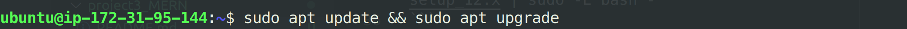
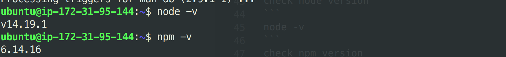
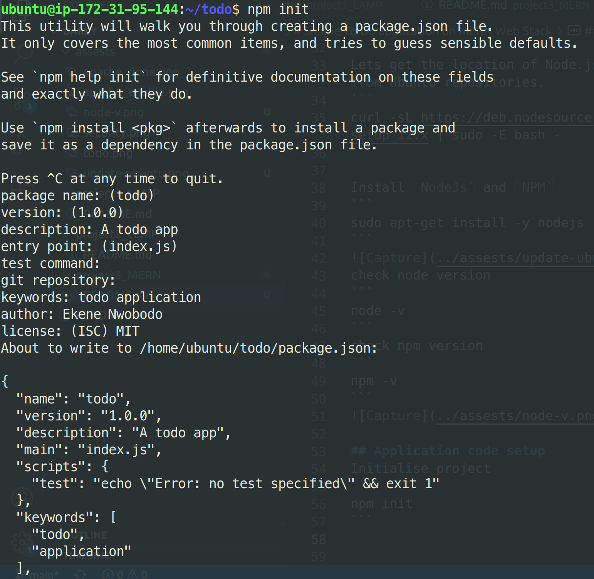
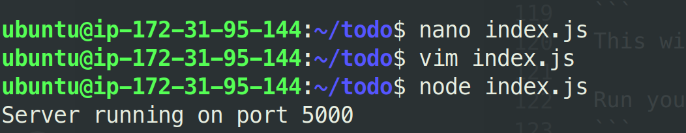
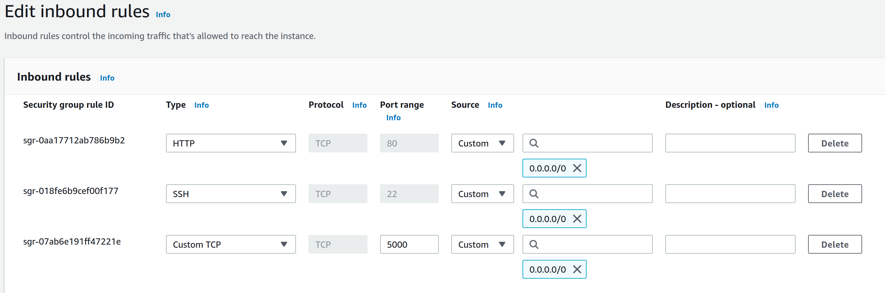
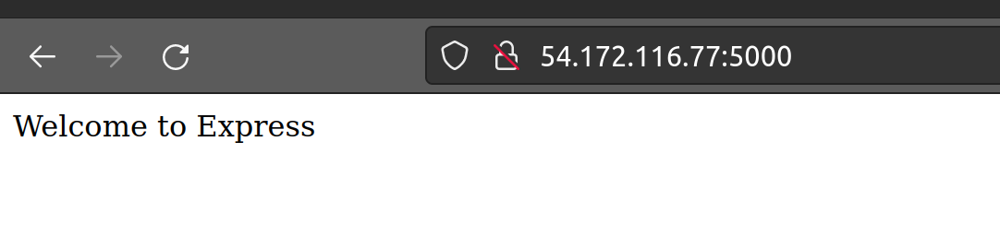
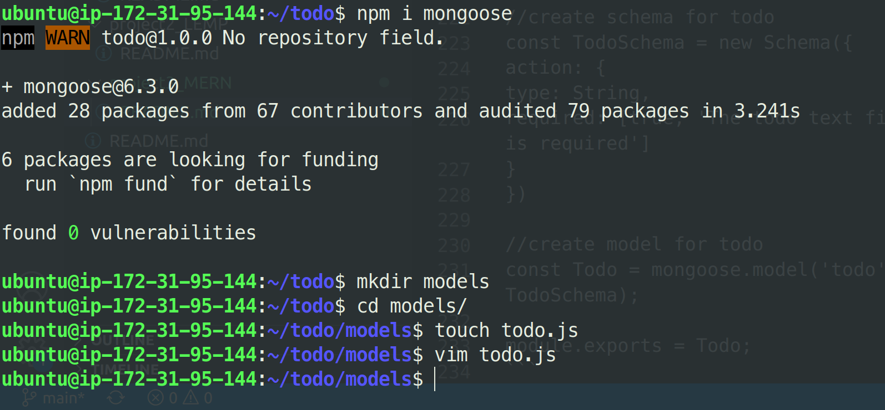
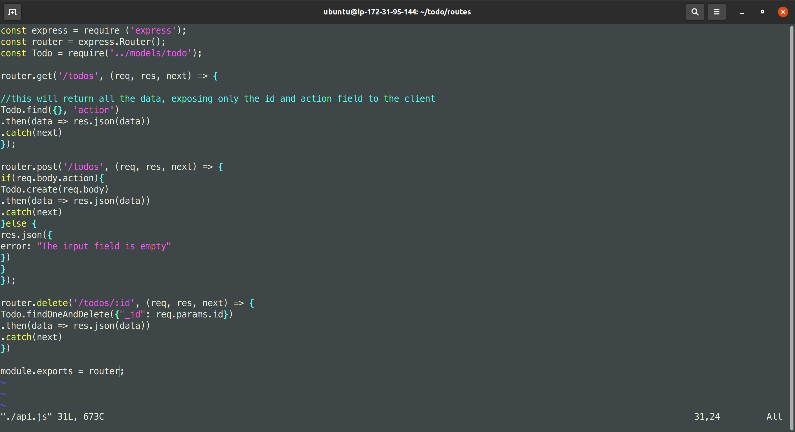

# Simple To-Do application on MERN Web Stack

### What is a technology stack
A tech stack are basically set of frameworks or tools used to develop a software product end-to-end.

This set of frameworks and tools are very specifically chosen to work together in creating a well-functioning software.

### Types of popular tech stacks
- LAMP (Linux, Apache, MySQL, PHP or Python, or Perl)
- LEMP (Linux, Nginx, MySQL, PHP or Python, or Perl)
- MERN (MongoDB, ExpressJS, ReactJS, NodeJS)
- MEAN (MongoDB, ExpressJS, AngularJS, NodeJS

To follow through the project, you need to set up a virtual machine with Ubuntu Server OS on the cloud (AWS Prefferred) or use it locally. I will be using AWS EC2 instance (Virtual machine owned by AWS).

Virtual machines emulates same features as your personal computers with storage and network adapters etc. You can connect to this virtual machine through it's public IP. You can also connect to services running on the VM. But for these to be possible, you need to expose it to be publicly accessible through a port.

### Connecting to EC2 terminal
- Save your private key `.pem` while creating your **ec2 instance**
- Change premissions for the private key file (.pem) otherwise you can get an error "Bad permissions"
`sudo chmod 0400 <private-key-name>.pem`
- connect to the instance 
```
ssh -i <private-key-name>.pem ubuntu@<Public-IP-address>
```

### Backend configurations
Update your ubuntu
```
sudo apt update && sudo apt-get upgrade
```

Lets get the location of Node.js software from Ubuntu repositories.
```
curl -sL https://deb.nodesource.com/setup_14.x | sudo -E bash -
```

Install `NodeJs` and `NPM`
```
sudo apt-get install -y nodejs
```

check node version
```
node -v
```
check npm version
```
npm -v
```


### Application code setup
Create a new directory for your To-Do project:
```
mkdir todo
```
Run the command below to verify that the Todo directory is created with ls command
```
ls
```
Go into the todo directory
```
cd todo
```
Initialise project
```
npm init
```


### Install ExpressJS

```
npm i express
```
Now create a file index.js with the command below
```
touch index.js
```
Run ls to confirm that your index.js file is successfully created

Install the dotenv module
```
npm install dotenv
```
Open the index.js file with the command below
```
vim index.js
```

Type the code below into it and save. 
```
const express = require('express');
require('dotenv').config();

const app = express();

const port = process.env.PORT || 5000;

app.use((req, res, next) => {
res.header("Access-Control-Allow-Origin", "\*");
res.header("Access-Control-Allow-Headers", "Origin, X-Requested-With, Content-Type, Accept");
next();
});

app.use((req, res, next) => {
res.send('Welcome to Express');
});

app.listen(port, () => {
console.log(`Server running on port ${port}`)
});
```

Save the file
```
Esc key then type :wq
```
This will write and exit the editor.

Run your app
```
node index.js
```


Notice that we have specified to use port 5000 in the code. This will be required later when we go on the browser.

Set up security rules to able to view your application on this `port 5000`



Open up your browser and try to access your server’s Public IP or Public DNS name followed by port 5000:
```
http://<PublicIP-or-PublicDNS>:5000
```


Routes

There are three actions that our To-Do application needs to be able to do:

    Create a new task
    Display list of all tasks
    Delete a completed task

Each task will be associated with some particular endpoint and will use different standard HTTP request methods: POST, GET, DELETE.

For each task, we need to create routes that will define various endpoints that the To-do app will depend on. So let us create a folder routes
```
mkdir routes
```
**Tip: You can open multiple shells in Putty or Linux/Mac to connect to the same EC2**

Change directory to routes folder.
```
cd routes
```
Now, create a file api.js with the command below
```
touch api.js
```
Open the file with the command below
```
vim api.js
```
Copy below code in the file. (Do not be overwhelmed with the code)
```
const express = require ('express');
const router = express.Router();

router.get('/todos', (req, res, next) => {

});

router.post('/todos', (req, res, next) => {

});

router.delete('/todos/:id', (req, res, next) => {

})

module.exports = router;
```
Moving forward create `Models` directory.
models to define the database schema

In essence, the Schema is a blueprint of how the database will be constructed, including other data fields that may not be required to be stored in the database. These are known as `virtual properties`

We will be using mongo database therefore we need another package to create our schema easily

```
cd ..
```

```
npm install mongoose
```

create models directory
```
mkdir models
```
```
cd models
```
```
touch todo.js
```

Tip: All three commands above can be defined in one line to be executed consequently with help of && operator, like this:
```
mkdir models && cd models && touch todo.js
```
Open the file created with `vim todo.js` then paste the code below in the file:
```
const mongoose = require('mongoose');
const Schema = mongoose.Schema;

//create schema for todo
const TodoSchema = new Schema({
action: {
type: String,
required: [true, 'The todo text field is required']
}
})

//create model for todo
const Todo = mongoose.model('todo', TodoSchema);

module.exports = Todo;
```


update the routes from the file `api.js` in ‘routes’ directory to make use of the new model.

In Routes directory, open api.js with vim api.js, delete the code inside with `:%d` command and paste there code below into it then save and exit

```
const express = require ('express');
const router = express.Router();
const Todo = require('../models/todo');

router.get('/todos', (req, res, next) => {

//this will return all the data, exposing only the id and action field to the client
Todo.find({}, 'action')
.then(data => res.json(data))
.catch(next)
});

router.post('/todos', (req, res, next) => {
if(req.body.action){
Todo.create(req.body)
.then(data => res.json(data))
.catch(next)
}else {
res.json({
error: "The input field is empty"
})
}
});

router.delete('/todos/:id', (req, res, next) => {
Todo.findOneAndDelete({"_id": req.params.id})
.then(data => res.json(data))
.catch(next)
})

module.exports = router;
```



setup mongodb database
