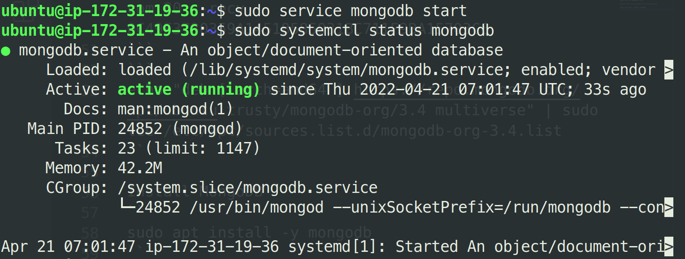
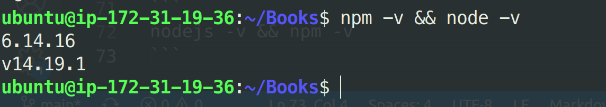
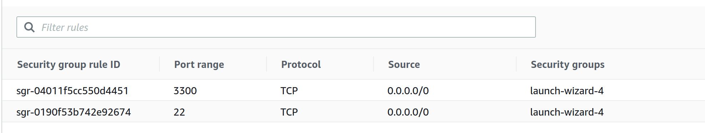
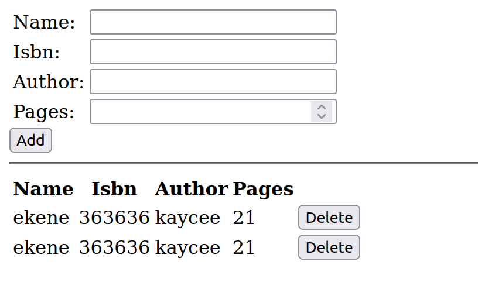

# MEAN Stack Deployment to Ubuntu in AWS.

### What is a technology stack
A tech stack are basically set of frameworks or tools used to develop a software product end-to-end.

This set of frameworks and tools are very specifically chosen to work together in creating a well-functioning software.

### Types of popular tech stacks
- LAMP (Linux, Apache, MySQL, PHP or Python, or Perl)
- LEMP (Linux, Nginx, MySQL, PHP or Python, or Perl)
- MERN (MongoDB, ExpressJS, ReactJS, NodeJS)
- MEAN (MongoDB, ExpressJS, AngularJS, NodeJS

To follow through the project, you need to set up a virtual machine with Ubuntu Server OS on the cloud (AWS Prefferred) or use it locally. I will be using AWS EC2 instance (Virtual machine owned by AWS).

Virtual machines emulates same features as your personal computers with storage and network adapters etc. You can connect to this virtual machine through it's public IP. You can also connect to services running on the VM. But for these to be possible, you need to expose it to be publicly accessible through a port.

### Connecting to EC2 terminal
- Save your private key `.pem` while creating your **ec2 instance**
- Change premissions for the private key file (.pem) otherwise you can get an error "Bad permissions"
`sudo chmod 0400 <private-key-name>.pem`
- connect to the instance 
```
ssh -i <private-key-name>.pem ubuntu@<Public-IP-address>
```

### Install Nodejs

Node.js is a JavaScript runtime built on Chrome’s V8 JavaScript engine. Node.js is used in this tutorial to set up the Express routes and AngularJS controllers.

Update and upgrade ubuntu
```
sudo apt update && sudo apt upgrade
```
Add certificates
```
sudo apt -y install curl dirmngr apt-transport-https lsb-release ca-certificates

curl -sL https://deb.nodesource.com/setup_14.x | sudo -E bash -
```
Install NodeJS
```
sudo apt install -y nodejs
```

### Install MongoDB
MongoDB stores data in flexible, JSON-like documents. Fields in a database can vary from document to document and data structure can be changed over time. For our example application, we are adding book records to MongoDB that contain book name, isbn number, author, and number of pages.
mages/WebConsole.gif
```
sudo apt-key adv --keyserver hkp://keyserver.ubuntu.com:80 --recv 0C49F3730359A14518585931BC711F9BA15703C6
```
```
echo "deb [ arch=amd64 ] https://repo.mongodb.org/apt/ubuntu trusty/mongodb-org/3.4 multiverse" | sudo tee /etc/apt/sources.list.d/mongodb-org-3.4.list
````

Install MongoDB
```
sudo apt install -y mongodb
```
Start The server
```
sudo service mongodb start
```
Verify that the service is up and running
```
sudo systemctl status mongodb
```


verify `nodejs` and `npm` version
```
node -v && npm -v
```


Create a folder named ‘Books’
```
mkdir Books && cd Books
```
In the Books directory, Initialize npm project
```
npm init
```
Add a file to it named server.js
```
vi server.js
```
Copy and paste the web server code below into the server.js file.

```
var express = require('express');
var app = express();
app.use(express.static(__dirname + '/public'));
app.use(express.json());
app.use(express.urlencoded({ extended: true }));
require('./apps/routes')(app);
app.set('port', 3300);
app.listen(app.get('port'), function() {
    console.log('Server up: http://localhost:' + app.get('port'));
});
```
We don't have express install so if we run our `app` there will be errors

### Install Express and mongoose
Express is a minimal and flexible Node.js web application framework that provides features for web and mobile applications. We will use Express in to pass book information to and from our MongoDB database.

We also will use Mongoose package which provides a straight-forward, schema-based solution to model your application data. We will use Mongoose to establish a schema for the database to store data of our book register.
```
sudo npm install express mongoose
```
In ‘Books’ folder, create a folder named apps
```
mkdir apps && cd apps
```
Create a file named routes.js
```
vi routes.js
```
Copy and paste the code below into routes.js
```
var Book = require('./models/book');
module.exports = function(app) {
  app.get('/book', function(req, res) {
    Book.find({}, function(err, result) {
      if ( err ) throw err;
      res.json(result);
    });
  }); 
  app.post('/book', function(req, res) {
    var book = new Book( {
      name:req.body.name,
      isbn:req.body.isbn,
      author:req.body.author,
      pages:req.body.pages
    });
    book.save(function(err, result) {
      if ( err ) throw err;
      res.json( {
        message:"Successfully added book",
        book:result
      });
    });
  });
  app.delete("/book/:isbn", function(req, res) {
    Book.findOneAndRemove(req.query, function(err, result) {
      if ( err ) throw err;
      res.json( {
        message: "Successfully deleted the book",
        book: result
      });
    });
  });
  var path = require('path');
  app.get('*', function(req, res) {
    res.sendfile(path.join(__dirname + '/public', 'index.html'));
  });
};
```
In the ‘apps’ folder, create a folder named models
```
mkdir models && cd models
```
Create a file named book.js
```
vi book.js
```
Copy and paste the code below into ‘book.js’
```
var mongoose = require('mongoose');
var dbHost = 'mongodb://localhost:27017/test';
mongoose.connect(dbHost);
mongoose.connection;
mongoose.set('debug', true);
var bookSchema = mongoose.Schema( {
  name: String,
  isbn: {type: String, index: true},
  author: String,
  pages: Number
});
var Book = mongoose.model('Book', bookSchema);
module.exports = mongoose.model('Book', bookSchema);
```
### Access the routes with AngularJS
AngularJS provides a web framework for creating dynamic views in your web applications. In this tutorial, we use AngularJS to connect our web page with Express and perform actions on our book register.

Change the directory back to ‘Books’
```
cd ../..
```
Create a folder named public
```
mkdir public && cd public
```
Add a file named script.js
```
vi script.js
```
Copy and paste the Code below (controller configuration defined) into the script.js file.
```
var app = angular.module('myApp', []);
app.controller('myCtrl', function($scope, $http) {
  $http( {
    method: 'GET',
    url: '/book'
  }).then(function successCallback(response) {
    $scope.books = response.data;
  }, function errorCallback(response) {
    console.log('Error: ' + response);
  });
  $scope.del_book = function(book) {
    $http( {
      method: 'DELETE',
      url: '/book/:isbn',
      params: {'isbn': book.isbn}
    }).then(function successCallback(response) {
      console.log(response);
    }, function errorCallback(response) {
      console.log('Error: ' + response);
    });
  };
  $scope.add_book = function() {
    var body = '{ "name": "' + $scope.Name + 
    '", "isbn": "' + $scope.Isbn +
    '", "author": "' + $scope.Author + 
    '", "pages": "' + $scope.Pages + '" }';
    $http({
      method: 'POST',
      url: '/book',
      data: body
    }).then(function successCallback(response) {
      console.log(response);
    }, function errorCallback(response) {
      console.log('Error: ' + response);
    });
  };
});
```
In public folder, create a file named index.html;
```
vi index.html
```
Copy and paste the code below into index.html file.
```
<!doctype html>
<html ng-app="myApp" ng-controller="myCtrl">
  <head>
    <script src="https://ajax.googleapis.com/ajax/libs/angularjs/1.6.4/angular.min.js"></script>
    <script src="script.js"></script>
  </head>
  <body>
    <div>
      <table>
        <tr>
          <td>Name:</td>
          <td><input type="text" ng-model="Name"></td>
        </tr>
        <tr>
          <td>Isbn:</td>
          <td><input type="text" ng-model="Isbn"></td>
        </tr>
        <tr>
          <td>Author:</td>
          <td><input type="text" ng-model="Author"></td>
        </tr>
        <tr>
          <td>Pages:</td>
          <td><input type="number" ng-model="Pages"></td>
        </tr>
      </table>
      <button ng-click="add_book()">Add</button>
    </div>
    <hr>
    <div>
      <table>
        <tr>
          <th>Name</th>
          <th>Isbn</th>
          <th>Author</th>
          <th>Pages</th>

        </tr>
        <tr ng-repeat="book in books">
          <td>{{book.name}}</td>
          <td>{{book.isbn}}</td>
          <td>{{book.author}}</td>
          <td>{{book.pages}}</td>

          <td><input type="button" value="Delete" data-ng-click="del_book(book)"></td>
        </tr>
      </table>
    </div>
  </body>
</html>
```
Change the directory back up to Books
```
cd ..
```
Start the server by running this command:
```
node server.js
```
The server is now up and running, we can connect it via port 3300. You can launch a separate Putty or SSH console to test what curl command returns locally.
```
curl -s http://localhost:3300
```
It shall return an HTML page, it is hardly readable in the CLI, but we can also try and access it from the Internet.

For this – you need to open TCP port 3300 in your AWS Web Console for your EC2 Instance.


Your Sercurity group shall look like this:


Now you can access our Book Register web application from the Internet with a browser using Public IP address or Public DNS name.

Quick reminder how to get your server’s Public IP and public DNS name:

    You can find it in your AWS web console in EC2 details
    Run curl -s http://169.254.169.254/latest/meta-data/public-ipv4 for Public IP address or curl -s http://169.254.169.254/latest/meta-data/public-hostname for Public DNS name.

This is how your Web Book Register Application will look like in browser:



CONGRATULATIONS!


