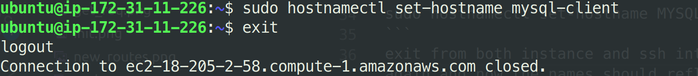
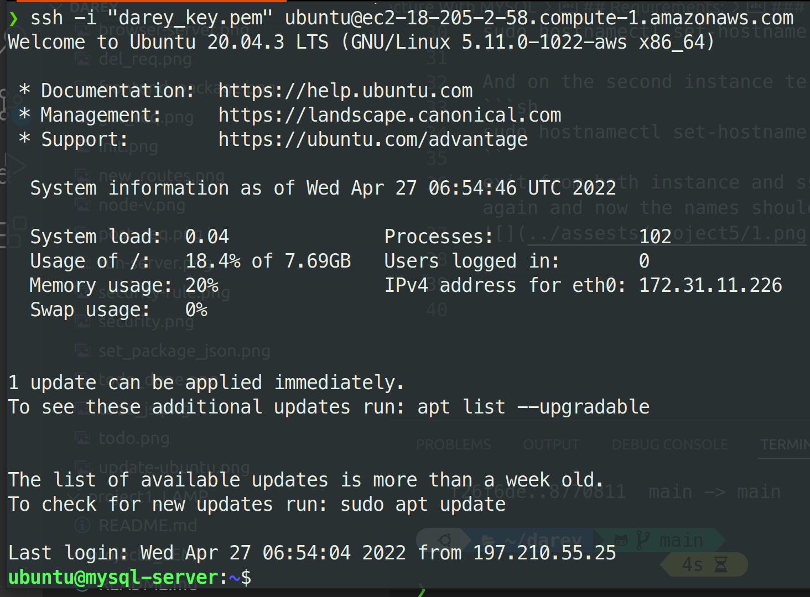
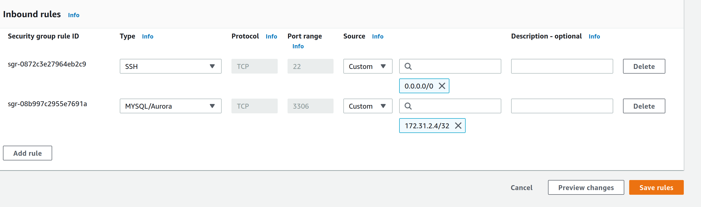
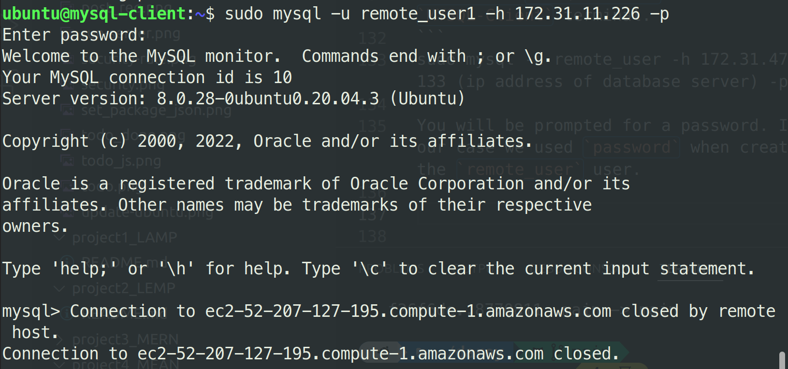

# Client-Server Architecture With MYSQL

**Interesting fact:** MySQL is an open-source relational database management system. Its name is a combination of "My", the name of co-founder Michael Widenius’s daughter, and "SQL", the abbreviation for Structured Query Language.

## Requirements:
- Two linux instances (virtual machine) running on AWS

Virtual machines emulates same features as your personal computers with storage and network adapters etc. You can connect to this virtual machine through it's public IP. You can also connect to services running on the VM. But for these to be possible, you need to expose it to be publicly accessible through a port.

### Connecting to EC2 terminal
- Save your private key `.pem` while creating your **ec2 instance**
- Change premissions for the private key file (.pem) otherwise you can get an error "Bad permissions"
`sudo chmod 0400 <private-key-name>.pem`
- connect to the instance 
```
ssh -i <private-key-name>.pem ubuntu@<Public-IP-address>

```
On both instances, run
```sh
sudo apt update -y && sudo apt upgrade -y
```

This will update and upgrade all programs and depencies on both instance.

Rename the first instance to `MYSQL-Server` and the second to `MYSQL-Client`. While this doesn't add any special functionality, it helps you keep track of which instance your currently running commands on.

On the first instance terminal, run
```sh
sudo hostnamectl set-hostname MYSQL-Server
```
And on the second instance terminal, run
```sh
sudo hostnamectl set-hostname MYSQL-Client
```
exit from both instance and ssh into them again and now the names should reflect.




### Install MYSQL server on the server instance.

```
sudo apt install mysql-server -y
```
### Install MYSQL client on the client instance.
```
sudo apt install mysql-client -y
```

Enable mysql
```
sudo systemctl enable mysql
```
Secure your Database by running 
```
sudo mysql_secure_installation
```

This will ask if you want to configure the 
```
VALIDATE PASSWORD PLUGIN.
```

Note: Enabling this feature is something of a judgment call. If enabled, passwords which don’t match the specified criteria will be rejected by MySQL with an error. It is safe to leave validation disabled, but you should always use strong, unique passwords for database credentials.

Answer `Y` for yes, or anything else to continue without enabling.

I will leave mine disabled.

Regardless of whether you chose to set up the `VALIDATE PASSWORD PLUGIN`, your server will next ask you to select and confirm a password for the MySQL root user. This is not to be confused with the system root. The database root user is an administrative user with full privileges over the database system. Even though the default authentication method for the MySQL root user dispenses the use of a password, even when one is set, you should define a strong password here as an additional safety measure. We’ll talk about this in a moment.

If you enabled password validation, you’ll be shown the password strength for the root password you just entered and your server will ask if you want to continue with that password. If you are happy with your current password, enter `Y` for “yes” at the prompt:

For the rest of the questions, press Y and hit the ENTER key at each prompt. This will remove some anonymous users and the test database, disable remote root logins, and load these new rules so that MySQL immediately respects the changes you have made.

When you’re finished, test if you’re able to log in to the MySQL console by typing:

```sh
sudo mysql
```

this will connect to MuSQL server as root (has all adminstrative rights)

`mysql> `

Configure MySQL server to allow connections from remote hosts. so exit `mysql` by running `exit` and hiting enter then run
```
sudo vi /etc/mysql/mysql.conf.d/mysqld.cnf
```
Replace `127.0.0.1` to `0.0.0.0` like this:


Restart `MYSQL` service
```
sudo systemctl restart mysql
```
Create user  and database for `MYSQL Server`. copy qnd run the commands below seqentially

```
sudo mysql

CREATE USER 'remote_user'@'%' IDENTIFIED WITH mysql_native_password BY 'password';

CREATE DATABASE test_db;

GRANT ALL ON test_db.* TO 'remote_user'@'%' WITH GRANT OPTION;

FLUSH PRIVILEGES;
```

The first command starts the `MYSQL server`. 
The second creates a user with the username `remote_user` and password as `password`. This is the password we will use to sign in remotely.

The third created a database with the name `test_db`

The fourth grants the created user permission on our created database.

Exit the `mysql` and restart the server again with
```
sudo systemctl restart mysql
```
We will try to connect to our server from our client using the newly created user.

First we need to edit our inbound rule in the `MYSQL-Server` instance so it accepts inbound rules from our `Client` instance. 

Copy the private `IP` instance of your `MYSQL-Client` and add it in the list of accepted inbound rule `IP`.



Access the `MYSQL-Server` from `MYSQL-Client` terminal.
```
sudo mysql -u remote_user -h 172.31.47.133 (ip address of database server) -p
```
You will be prompted for a password. In our case we used `password` when creating the `remote_user` user.



Congratulations!! you have successfully connected from your client to the server remotely.


