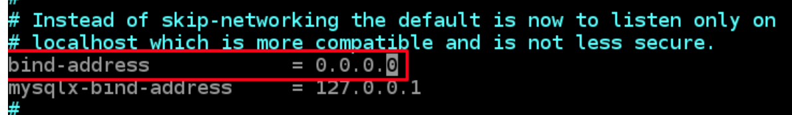

In this project you will be tasked to prepare storage infrastructure on two Linux servers and implement a basic web solution using [WordPress](https://en.wikipedia.org/wiki/WordPress). WordPress is a free and open-source content management system written in PHP and paired with MySQL or MariaDB as its backend Relational Database Management System (RDBMS).

**Interesting fact:** MySQL is an open-source relational database management system. Its name is a combination of "My", the name of co-founder Michael Widenius’s daughter, and "SQL", the abbreviation for Structured Query Language.

## Requirements:
- Two linux instances (virtual machine) running on AWS (REDHAT OS preffered)

Three-tier Architecture

Generally, web, or mobile solutions are implemented based on what is called the Three-tier Architecture.

Three-tier Architecture is a client-server software architecture pattern that comprise of 3 separate layers.


1. Presentation Layer (PL): This is the user interface such as the client server or browser on your laptop.
2. Business Layer (BL): This is the backend program that implements business logic. Application or Webserver
3. Data Access or Management Layer (DAL): This is the layer for computer data storage and data access. Database Server or File System Server such as FTP server, or NFS Server

Your 3-Tier Setup

1. A Laptop or PC to serve as a client
2. An EC2 Linux Server as a web server (This is where you will install WordPress)
3. An EC2 Linux server as a database (DB) server

## Launch an EC2 instance that will serve as “Web Server”.

Step 1 — Prepare a Web Server

Launch an EC2 instance that will serve as "Web Server". Create 3 volumes in the same Availability zone (AZ) as your Web Server EC2, each of 10 GiB.

Learn how to do this attach an EBS volume to an instance here [here](https://www.youtube.com/watch?v=HPXnXkBzIHw)

Attach all three volumes one by one to your Web Server EC2 instance.


first see the name of all the instance and that its present in your `/dev/` directory.
```
lsblk
```

Create a single partition on each of the 3 disk with `gdisk` command
 ```
sudo gdisk /dev/xvdf
```

Do this for both `xvdg` and `xvdh` created volumes.

view the newly configured partition on each of the 3 disks.


install `lvm2` package using `sudo yum install lvm2`. Run `sudo lvmdiskscan` command to check for available partitions.

**Note: RedHat/CentOS a different package manager is used, so we shall use yum command instead.**

Verify that your Physical volume has been created successfully by running `sudo pvs`

Add all 3 PVs to a volume group (VG). Name the VG webdata-vg
```
sudo vgcreate webdata-vg /dev/xvdh1 /dev/xvdg1 /dev/xvdf1
```
Verify that your VG has been created successfully by running `sudo vgs`


Use lvcreate utility to create 2 logical volumes. apps-lv (Use half of the PV size), and logs-lv Use the remaining space of the PV size. NOTE: apps-lv will be used to store data for the Website while, logs-lv will be used to store data for logs.

`sudo lvcreate -n apps-lv -L 14G webdata-vg`
`sudo lvcreate -n logs-lv -L 14G webdata-vg`

Verify that your Logical Volume has been created successfully by running sudo `lvs`


Verify the entire setup
```
sudo vgdisplay -v #view complete setup - VG, PV, and LV
sudo lsblk 
```

Use mkfs.ext4 to format the logical volumes with ext4 filesystem
```
sudo mkfs -t ext4 /dev/webdata-vg/apps-lv
sudo mkfs -t ext4 /dev/webdata-vg/logs-lv
```


Create /var/www/html directory to store website files
```
sudo mkdir -p /var/www/html
```
 Create /home/recovery/logs to store backup of log data
```
sudo mkdir -p /home/recovery/logs
```
 Mount `/var/www/html` on `apps-lv` logical volume
```
sudo mount /dev/webdata-vg/apps-lv /var/www/html/
```
Use rsync utility to backup all the files in the log directory /var/log into /home/recovery/logs (This is required before mounting the file system)
```
sudo rsync -av /var/log/. /home/recovery/logs/
```
Mount /var/log on logs-lv logical volume. (Note that all the existing data on /var/log will be deleted. That is why step 15 above is very important)
```
sudo mount /dev/webdata-vg/logs-lv /var/log
```
Restore log files back into /var/log directory
```
sudo rsync -av /home/recovery/logs/. /var/log
```
Update /etc/fstab file so that the mount configuration will persist after restart of the server.

### update the `/etc/fstab` file

The UUID of the device will be used to update the `/etc/fstab` file;
```
sudo blkid
```

```
sudo vi /etc/fstab
```
Update /etc/fstab in this format using your own UUID and rememeber to remove the leading and ending quotes.


Test the configuration and reload the daemon
```
sudo mount -a
sudo systemctl daemon-reload
```
Verify your setup by running df -h, output must look like this:


## Prepare the Database Server

Launch a second RedHat EC2 instance that will have a role – `DB Server`
Repeat the same steps as for the Web Server, but instead of `apps-lv` create `db-lv` and mount it to `/db` directory instead of `/var/www/html/`.

### Install WordPress on your Web Server EC2

Update the repository
```
sudo yum -y update
```
Install wget, Apache and it’s dependencies
```
sudo yum -y install wget httpd php php-mysqlnd php-fpm php-json
```
Start Apache
```
sudo systemctl enable httpd
sudo systemctl start httpd
```
To install PHP and it’s depemdencies
```    
sudo yum install https://dl.fedoraproject.org/pub/epel/epel-release-latest-8.noarch.rpm
sudo yum install yum-utils http://rpms.remirepo.net/enterprise/remi-release-8.rpm
sudo yum module list php
sudo yum module reset php
sudo yum module enable php:remi-7.4
sudo yum install php php-opcache php-gd php-curl php-mysqlnd
sudo systemctl start php-fpm
sudo systemctl enable php-fpm
setsebool -P httpd_execmem 1
```
Restart Apache
```
sudo systemctl restart httpd
```
Download wordpress and copy wordpress to var/www/html
```
mkdir wordpress
cd   wordpress
sudo wget http://wordpress.org/latest.tar.gz
sudo tar xzvf latest.tar.gz
sudo rm -rf latest.tar.gz
cp wordpress/wp-config-sample.php wordpress/wp-config.php
cp -R wordpress /var/www/html/
```
Configure SELinux Policies
```
sudo chown -R apache:apache /var/www/html/wordpress
sudo chcon -t httpd_sys_rw_content_t /var/www/html/wordpress -R
sudo setsebool -P httpd_can_network_connect=1
```
Install MySQL on your DB Server EC2
```
sudo yum update
sudo yum install mysql-server
```
Verify that the service is up and running by using sudo systemctl status mysqld, if it is not running, restart the service and enable it so it will be running even after reboot:
```
sudo systemctl restart mysqld
sudo systemctl enable mysqld
```
Configure DB to work with WordPress
```
sudo mysql
CREATE DATABASE wordpress;
CREATE USER `myuser`@`<Web-Server-Private-IP-Address>` IDENTIFIED BY 'mypass';
GRANT ALL ON wordpress.* TO 'myuser'@'<Web-Server-Private-IP-Address>';
FLUSH PRIVILEGES;
SHOW DATABASES;
exit
```

Configure MySQL server to allow connections from remote hosts. so exit `mysql` by running `exit` and hiting enter then run
```
sudo vi /etc/mysql/mysql.conf.d/mysqld.cnf
```
Replace `127.0.0.1` to `0.0.0.0` like this:


Restart `MYSQL` service
```
sudo systemctl restart mysql
```

### Configure WordPress to connect to remote database
**Hint: Do not forget to open MySQL port 3306 on DB Server EC2.**


Install MySQL client and test that you can connect from your Web Server to your DB server by using mysql-client
```
sudo yum install mysql
sudo mysql -u myuser -p -h <DB-Server-Private-IP-address>
```

Verify if you can successfully execute `SHOW DATABASES;` command and see a list of existing databases.

Change permissions and configuration so Apache could use WordPress:

Enable TCP port 80 in Inbound Rules configuration for your Web Server EC2 (enable from everywhere 0.0.0.0/0 or from your workstation’s IP)


Try to access from your browser the link to your WordPress `http://<Web-Server-Public-IP-Address>/wordpress/`

fill up credentials and `login`


If you get a `database connection error`, edit your wordpress config file and insert the configurations you used when creating and setting up your data base above.
```
sudo vi /var/www/html/wordpress/wp-config.php
```


exit and reload your web page.

Congratulations!!!
